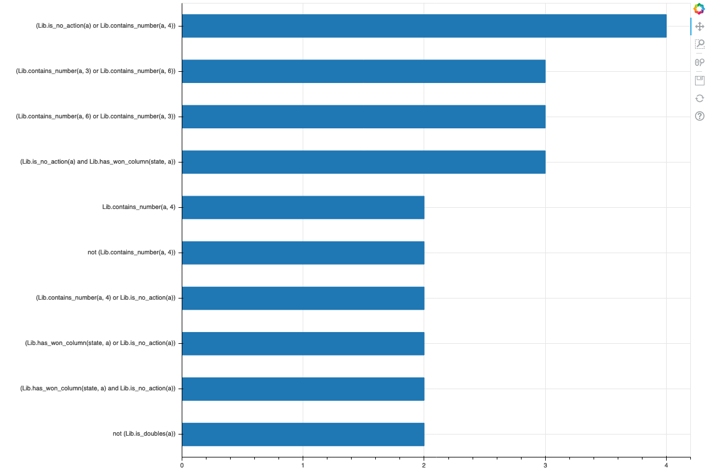
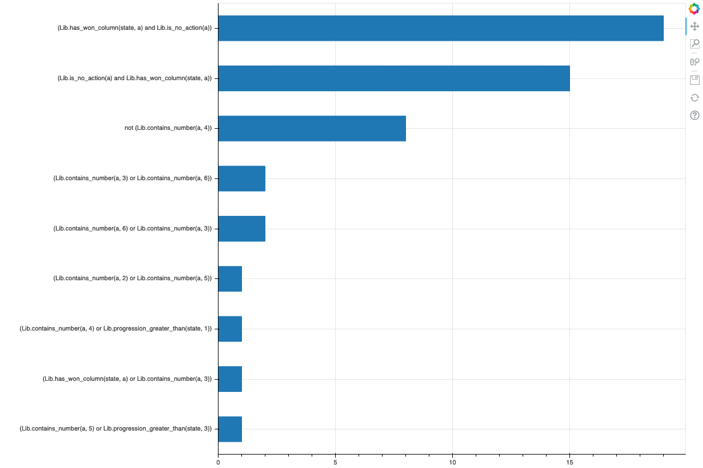
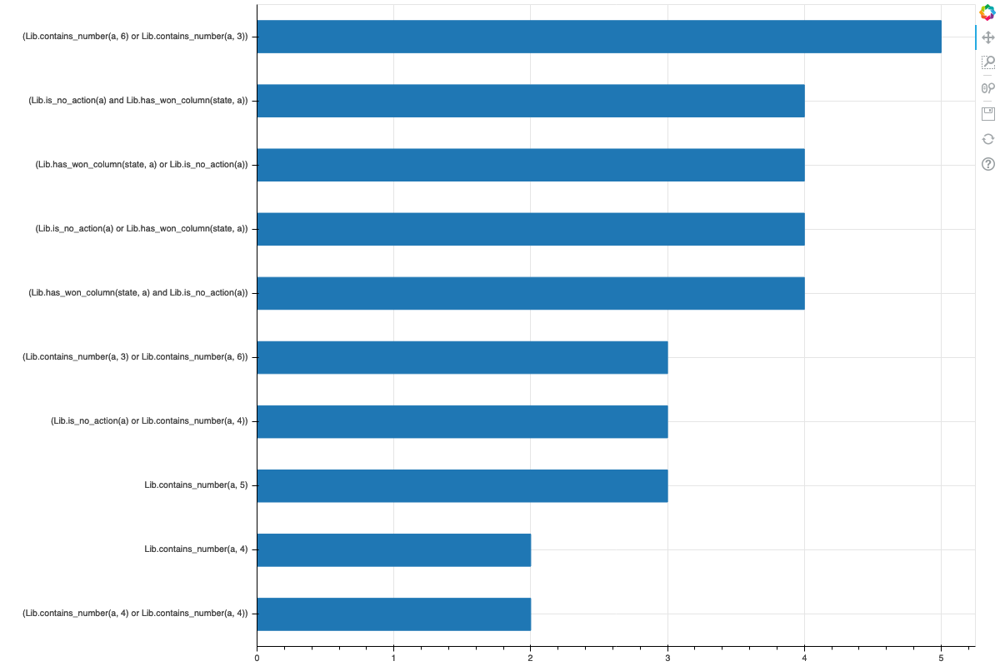
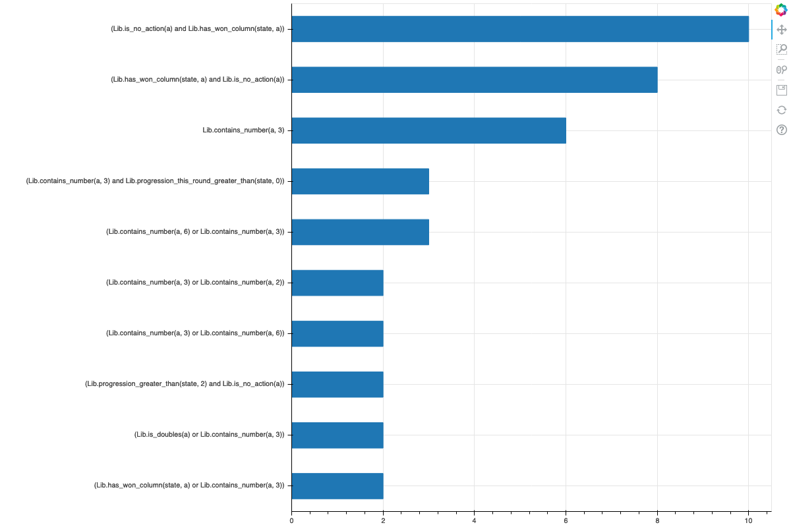

Inspired by [Distill](https://distill.pub/) and
[World Models](https://worldmodels.github.io/),
I decided to do a narrative by using actual code for this report.


```python
# load code in the other file
%run sandbox.ipynb
```

# My Approach

I re-used my DSL for the first assignment with some modifications, so the DSL this time won't produce nested `if` blocks. 

As usual, a script is render by an abstract syntax tree (AST) derived from the DSL.


```python
print("AST:")
ast = get_random_tree()
print_tree(ast)
```

    AST:
    Rule.START
    +-- Rule.IF_BLOCK
        |-- Rule.BOOL_EXP
        |   +-- Rule.OR_EXP
        |       |-- Rule.BOOL
        |       |   +-- Rule.FUNC_CALL
        |       |       |-- Lib.column_progression_this_round_greater_than
        |       |       |-- state
        |       |       |-- Rule.COLUMN_NUM
        |       |       |   +-- 2
        |       |       +-- Rule.SMALL_NUM
        |       |           +-- 0
        |       +-- Rule.BOOL
        |           +-- Rule.FUNC_CALL
        |               |-- Lib.column_progression_greater_than
        |               |-- state
        |               |-- Rule.COLUMN_NUM
        |               |   +-- 2
        |               +-- Rule.SMALL_NUM
        |                   +-- 2
        +-- Rule.IF_BODY
            +-- Rule.RETURN
                +-- return a


```python
print("Script:")
print(render_script(ast)[1])
```

    Script:
    
    
    class Script_4c366fd81e2c42dba7d3d68b804c7385(Script):
        def get_action(self, state):
            actions = state.available_moves()
            for a in actions:
                if ((Lib.column_progression_this_round_greater_than(state, 2, 0) or Lib.column_progression_greater_than(state, 2, 2))):
                    return a
            return actions[0]
    


To experiment faster, I do not create UCT samples for each run. Instead, I first a huge pool of UCT samples and randomly draw samples from it.


```python
get_uct_samples(num_samples=5)
```


    [(<game.Game at 0x118324f90>, (3, 4)),
     (<game.Game at 0x118ad0910>, 'y'),
     (<game.Game at 0x11c0d7250>, 'n'),
     (<game.Game at 0x117c74b50>, (3, 2)),
     (<game.Game at 0x116517810>, 'n')]


The sketch I used is the same as the previous one.


```python
print(script_template)
```

    
    
    class {0}(Script):
        def get_action(self, state):
            actions = state.available_moves()
            for a in actions:
    {1}
            return actions[0]
    


The proposal function randomly select a node in an AST, remove it, and add new sub-tree by deriving from the DSL. The property described in the assignment description that trees tend to have more leaves than internal nodes does not hold here. In my implementation, tree leaves are usually around five while internal nodes are around seven. As a result, it's more likely for my proposal function to alter the entire function call instead of changing a parameter inside of a function call.


```python
print("Before:")
tree = get_random_tree()
script = exec_tree(tree)
print_tree(script.tree)
new_script = propose_new_script(script)
print("After:")
print_tree(new_script.tree)
```

    Before:
    Rule.START
    +-- Rule.IF_BLOCK
        |-- Rule.BOOL_EXP
        |   +-- Rule.OR_EXP
        |       |-- Rule.BOOL
        |       |   +-- Rule.FUNC_CALL
        |       |       |-- Lib.progression_greater_than
        |       |       |-- state
        |       |       +-- Rule.SMALL_NUM
        |       |           +-- 1
        |       +-- Rule.BOOL
        |           +-- Rule.FUNC_CALL
        |               |-- Lib.column_progression_greater_than
        |               |-- state
        |               |-- Rule.COLUMN_NUM
        |               |   +-- 6
        |               +-- Rule.SMALL_NUM
        |                   +-- 2
        +-- Rule.IF_BODY
            +-- Rule.RETURN
                +-- return a
    After:
    Rule.START
    +-- Rule.IF_BLOCK
        |-- Rule.BOOL_EXP
        |   +-- Rule.OR_EXP
        |       |-- Rule.BOOL
        |       |   +-- Rule.FUNC_CALL
        |       |       |-- Lib.progression_this_round_greater_than
        |       |       |-- state
        |       |       +-- Rule.SMALL_NUM
        |       |           +-- 0
        |       +-- Rule.BOOL
        |           +-- Rule.FUNC_CALL
        |               |-- Lib.column_progression_greater_than
        |               |-- state
        |               |-- Rule.COLUMN_NUM
        |               |   +-- 6
        |               +-- Rule.SMALL_NUM
        |                   +-- 2
        +-- Rule.IF_BODY
            +-- Rule.RETURN
                +-- return a


In the assignment description it says we create a new $M_2 < M_1$ by removing correct samples from the previous `if` clause.
However, since the sketch returns the first action by default, there is no guarantee that the correct samples for $r1$ is still correct for $r1 + r2$.
This problem can be alleviated by sampling $r2$ with $r1$ as a fixed part in its script.
This way $r2$ is sampled in a way that it only takes care of leftover samples from $r1$.
To compare these different methods, I will use two parameters to control them in the experiment.
`filter_sample` decides whether to filter out correct samples after completing a clause or not.
`merge` decides whether to obtain new clauses by combining previous clauses.

# Experiments and Discussion

We first establish a baseline for experiments with a random agent:


```python
print_errors([(get_uct_samples(10000), [PlayerRandom()])])
```

    error rate:  42.38 %
    average error rate: 42.38 %


Now we experiment with different setting and observe their results.
There are three things we will consider: (1) their error rate which is the percetage of samples that the strategy is wrong (2) their clause frequency plot, which indicates what clauses are more popular than the others (3) their win rates against a random agent

## the defaul setting, with filtering samples and without merging previous clauses


```python
multiple_run_scripts = []
for _ in tqdm.tqdm(range(10)):
    uct_samples = get_uct_samples(1000)
    scripts = run_synthesis(uct_samples, iterations=1000, filter_sample=True, merge=False)
    multiple_run_scripts.append((uct_samples, scripts))
```

    100%|██████████| 10/10 [22:33<00:00, 135.36s/it]


```python
print_errors(multiple_run_scripts)
plot_common_clauses([script for _, scripts in multiple_run_scripts for script in scripts], 'true_false.png')
```

    error rate:  37.4 %
    error rate:  39.300000000000004 %
    error rate:  40.0 %
    error rate:  39.5 %
    error rate:  35.5 %
    error rate:  52.400000000000006 %
    error rate:  39.800000000000004 %
    error rate:  36.4 %
    error rate:  38.2 %
    error rate:  37.0 %
    average error rate: 39.550000000000004 %


<div style="display: table;"><div style="display: table-row;"><div style="display: table-cell;"><b title="bokeh.plotting.figure.Figure">Figure</b>(</div><div style="display: table-cell;">id&nbsp;=&nbsp;'1001', <span id="1154" style="cursor: pointer;">&hellip;)</span></div></div><div class="1153" style="display: none;"><div style="display: table-cell;"></div><div style="display: table-cell;">above&nbsp;=&nbsp;[],</div></div><div class="1153" style="display: none;"><div style="display: table-cell;"></div><div style="display: table-cell;">align&nbsp;=&nbsp;'start',</div></div><div class="1153" style="display: none;"><div style="display: table-cell;"></div><div style="display: table-cell;">aspect_ratio&nbsp;=&nbsp;None,</div></div><div class="1153" style="display: none;"><div style="display: table-cell;"></div><div style="display: table-cell;">aspect_scale&nbsp;=&nbsp;1,</div></div><div class="1153" style="display: none;"><div style="display: table-cell;"></div><div style="display: table-cell;">background&nbsp;=&nbsp;None,</div></div><div class="1153" style="display: none;"><div style="display: table-cell;"></div><div style="display: table-cell;">background_fill_alpha&nbsp;=&nbsp;1.0,</div></div><div class="1153" style="display: none;"><div style="display: table-cell;"></div><div style="display: table-cell;">background_fill_color&nbsp;=&nbsp;'#ffffff',</div></div><div class="1153" style="display: none;"><div style="display: table-cell;"></div><div style="display: table-cell;">below&nbsp;=&nbsp;[LinearAxis(id='1010', ...)],</div></div><div class="1153" style="display: none;"><div style="display: table-cell;"></div><div style="display: table-cell;">border_fill_alpha&nbsp;=&nbsp;1.0,</div></div><div class="1153" style="display: none;"><div style="display: table-cell;"></div><div style="display: table-cell;">border_fill_color&nbsp;=&nbsp;'#ffffff',</div></div><div class="1153" style="display: none;"><div style="display: table-cell;"></div><div style="display: table-cell;">center&nbsp;=&nbsp;[Grid(id='1013', ...), Grid(id='1016', ...)],</div></div><div class="1153" style="display: none;"><div style="display: table-cell;"></div><div style="display: table-cell;">css_classes&nbsp;=&nbsp;[],</div></div><div class="1153" style="display: none;"><div style="display: table-cell;"></div><div style="display: table-cell;">disabled&nbsp;=&nbsp;False,</div></div><div class="1153" style="display: none;"><div style="display: table-cell;"></div><div style="display: table-cell;">extra_x_ranges&nbsp;=&nbsp;{},</div></div><div class="1153" style="display: none;"><div style="display: table-cell;"></div><div style="display: table-cell;">extra_y_ranges&nbsp;=&nbsp;{},</div></div><div class="1153" style="display: none;"><div style="display: table-cell;"></div><div style="display: table-cell;">frame_height&nbsp;=&nbsp;None,</div></div><div class="1153" style="display: none;"><div style="display: table-cell;"></div><div style="display: table-cell;">frame_width&nbsp;=&nbsp;None,</div></div><div class="1153" style="display: none;"><div style="display: table-cell;"></div><div style="display: table-cell;">height&nbsp;=&nbsp;None,</div></div><div class="1153" style="display: none;"><div style="display: table-cell;"></div><div style="display: table-cell;">height_policy&nbsp;=&nbsp;'auto',</div></div><div class="1153" style="display: none;"><div style="display: table-cell;"></div><div style="display: table-cell;">hidpi&nbsp;=&nbsp;True,</div></div><div class="1153" style="display: none;"><div style="display: table-cell;"></div><div style="display: table-cell;">js_event_callbacks&nbsp;=&nbsp;{},</div></div><div class="1153" style="display: none;"><div style="display: table-cell;"></div><div style="display: table-cell;">js_property_callbacks&nbsp;=&nbsp;{},</div></div><div class="1153" style="display: none;"><div style="display: table-cell;"></div><div style="display: table-cell;">left&nbsp;=&nbsp;[CategoricalAxis(id='1014', ...)],</div></div><div class="1153" style="display: none;"><div style="display: table-cell;"></div><div style="display: table-cell;">lod_factor&nbsp;=&nbsp;10,</div></div><div class="1153" style="display: none;"><div style="display: table-cell;"></div><div style="display: table-cell;">lod_interval&nbsp;=&nbsp;300,</div></div><div class="1153" style="display: none;"><div style="display: table-cell;"></div><div style="display: table-cell;">lod_threshold&nbsp;=&nbsp;2000,</div></div><div class="1153" style="display: none;"><div style="display: table-cell;"></div><div style="display: table-cell;">lod_timeout&nbsp;=&nbsp;500,</div></div><div class="1153" style="display: none;"><div style="display: table-cell;"></div><div style="display: table-cell;">margin&nbsp;=&nbsp;(0, 0, 0, 0),</div></div><div class="1153" style="display: none;"><div style="display: table-cell;"></div><div style="display: table-cell;">match_aspect&nbsp;=&nbsp;False,</div></div><div class="1153" style="display: none;"><div style="display: table-cell;"></div><div style="display: table-cell;">max_height&nbsp;=&nbsp;None,</div></div><div class="1153" style="display: none;"><div style="display: table-cell;"></div><div style="display: table-cell;">max_width&nbsp;=&nbsp;None,</div></div><div class="1153" style="display: none;"><div style="display: table-cell;"></div><div style="display: table-cell;">min_border&nbsp;=&nbsp;5,</div></div><div class="1153" style="display: none;"><div style="display: table-cell;"></div><div style="display: table-cell;">min_border_bottom&nbsp;=&nbsp;None,</div></div><div class="1153" style="display: none;"><div style="display: table-cell;"></div><div style="display: table-cell;">min_border_left&nbsp;=&nbsp;None,</div></div><div class="1153" style="display: none;"><div style="display: table-cell;"></div><div style="display: table-cell;">min_border_right&nbsp;=&nbsp;None,</div></div><div class="1153" style="display: none;"><div style="display: table-cell;"></div><div style="display: table-cell;">min_border_top&nbsp;=&nbsp;None,</div></div><div class="1153" style="display: none;"><div style="display: table-cell;"></div><div style="display: table-cell;">min_height&nbsp;=&nbsp;None,</div></div><div class="1153" style="display: none;"><div style="display: table-cell;"></div><div style="display: table-cell;">min_width&nbsp;=&nbsp;None,</div></div><div class="1153" style="display: none;"><div style="display: table-cell;"></div><div style="display: table-cell;">name&nbsp;=&nbsp;None,</div></div><div class="1153" style="display: none;"><div style="display: table-cell;"></div><div style="display: table-cell;">outline_line_alpha&nbsp;=&nbsp;1.0,</div></div><div class="1153" style="display: none;"><div style="display: table-cell;"></div><div style="display: table-cell;">outline_line_cap&nbsp;=&nbsp;'butt',</div></div><div class="1153" style="display: none;"><div style="display: table-cell;"></div><div style="display: table-cell;">outline_line_color&nbsp;=&nbsp;'#e5e5e5',</div></div><div class="1153" style="display: none;"><div style="display: table-cell;"></div><div style="display: table-cell;">outline_line_dash&nbsp;=&nbsp;[],</div></div><div class="1153" style="display: none;"><div style="display: table-cell;"></div><div style="display: table-cell;">outline_line_dash_offset&nbsp;=&nbsp;0,</div></div><div class="1153" style="display: none;"><div style="display: table-cell;"></div><div style="display: table-cell;">outline_line_join&nbsp;=&nbsp;'bevel',</div></div><div class="1153" style="display: none;"><div style="display: table-cell;"></div><div style="display: table-cell;">outline_line_width&nbsp;=&nbsp;1,</div></div><div class="1153" style="display: none;"><div style="display: table-cell;"></div><div style="display: table-cell;">output_backend&nbsp;=&nbsp;'canvas',</div></div><div class="1153" style="display: none;"><div style="display: table-cell;"></div><div style="display: table-cell;">plot_height&nbsp;=&nbsp;800,</div></div><div class="1153" style="display: none;"><div style="display: table-cell;"></div><div style="display: table-cell;">plot_width&nbsp;=&nbsp;1200,</div></div><div class="1153" style="display: none;"><div style="display: table-cell;"></div><div style="display: table-cell;">renderers&nbsp;=&nbsp;[GlyphRenderer(id='1033', ...)],</div></div><div class="1153" style="display: none;"><div style="display: table-cell;"></div><div style="display: table-cell;">reset_policy&nbsp;=&nbsp;'standard',</div></div><div class="1153" style="display: none;"><div style="display: table-cell;"></div><div style="display: table-cell;">right&nbsp;=&nbsp;[],</div></div><div class="1153" style="display: none;"><div style="display: table-cell;"></div><div style="display: table-cell;">sizing_mode&nbsp;=&nbsp;None,</div></div><div class="1153" style="display: none;"><div style="display: table-cell;"></div><div style="display: table-cell;">subscribed_events&nbsp;=&nbsp;[],</div></div><div class="1153" style="display: none;"><div style="display: table-cell;"></div><div style="display: table-cell;">tags&nbsp;=&nbsp;[],</div></div><div class="1153" style="display: none;"><div style="display: table-cell;"></div><div style="display: table-cell;">title&nbsp;=&nbsp;Title(id='1035', ...),</div></div><div class="1153" style="display: none;"><div style="display: table-cell;"></div><div style="display: table-cell;">title_location&nbsp;=&nbsp;'above',</div></div><div class="1153" style="display: none;"><div style="display: table-cell;"></div><div style="display: table-cell;">toolbar&nbsp;=&nbsp;Toolbar(id='1023', ...),</div></div><div class="1153" style="display: none;"><div style="display: table-cell;"></div><div style="display: table-cell;">toolbar_location&nbsp;=&nbsp;'right',</div></div><div class="1153" style="display: none;"><div style="display: table-cell;"></div><div style="display: table-cell;">toolbar_sticky&nbsp;=&nbsp;True,</div></div><div class="1153" style="display: none;"><div style="display: table-cell;"></div><div style="display: table-cell;">visible&nbsp;=&nbsp;True,</div></div><div class="1153" style="display: none;"><div style="display: table-cell;"></div><div style="display: table-cell;">width&nbsp;=&nbsp;None,</div></div><div class="1153" style="display: none;"><div style="display: table-cell;"></div><div style="display: table-cell;">width_policy&nbsp;=&nbsp;'auto',</div></div><div class="1153" style="display: none;"><div style="display: table-cell;"></div><div style="display: table-cell;">x_range&nbsp;=&nbsp;DataRange1d(id='1002', ...),</div></div><div class="1153" style="display: none;"><div style="display: table-cell;"></div><div style="display: table-cell;">x_scale&nbsp;=&nbsp;LinearScale(id='1006', ...),</div></div><div class="1153" style="display: none;"><div style="display: table-cell;"></div><div style="display: table-cell;">y_range&nbsp;=&nbsp;FactorRange(id='1004', ...),</div></div><div class="1153" style="display: none;"><div style="display: table-cell;"></div><div style="display: table-cell;">y_scale&nbsp;=&nbsp;CategoricalScale(id='1008', ...))</div></div></div>
<script>
(function() {
  var expanded = false;
  var ellipsis = document.getElementById("1154");
  ellipsis.addEventListener("click", function() {
    var rows = document.getElementsByClassName("1153");
    for (var i = 0; i < rows.length; i++) {
      var el = rows[i];
      el.style.display = expanded ? "none" : "table-row";
    }
    ellipsis.innerHTML = expanded ? "&hellip;)" : "&lsaquo;&lsaquo;&lsaquo;";
    expanded = !expanded;
  });
})();
</script>





```python
print_winrates(multiple_run_scripts)
```

    win rate: 0.0 %
    win rate: 0.0 %
    win rate: 0.0 %
    win rate: 0.0 %
    win rate: 0.0 %
    win rate: 0.0 %
    win rate: 0.0 %
    win rate: 0.0 %
    win rate: 0.0 %
    win rate: 0.0 %
    average win rate: 0.0 %


The error rate of this setting is not stable, ranging from 36% to 52%.
The average is around 40%, which is only slightly better than the baseline.
The most popular clause only appeared 4 times, which means multiple runs of the algorithm do not yield similar scripts.
The winrate is alwyas zero means the scripts obtained by this method do not perform well at all.

There are quite a few reasons why this happens:

- **removing training samples increases overfitting**

The origianl algorithm removes correct samples from $M1$ to form a smaller pool $M2$ for obtaining $r2$.
This means by the time we want to find $r5$, we only have a tiny $M5$ left. 
Smaller datasets lead to overfitting, and there's no exception here.
As we see from the clause frequency chart, the most common two clauses both takes a specific number into consideration.
This is likely a sign of overfitting.

- **`not` and `or` operators increases overfitting**

In my DSL, I added the `not` and `or` operators to allow more script flexibilities.
However, adding these clauses makes overfitting even worse for the algorithm because now it has better tools to overfit.
Instead of specifiying a speific case, it now can either negate a rare case to match other scenarios, or concatanate two general cases to form an even more general case.
As we can see from the frequency chart, the top two popular clauses are exploiting this grammar.
 
- **'yes' or 'no' actions is treated the same as dice actions**

This is the major reason that the win rate of scripts produced by this strategy is zero instead of a small number.
The scripts always burst, which means the scripts say 'yes' too frequently.
This could happen when the first clause is something like `not is_doubles(action)`.
Since the action 'y' always precedes 'n', a script starts with this clause will always burst.

- **adding new clauses to a script has unpredictable side-effects**

The idea of filtering $M1$ to obtain $M2$ is to have a $r1$ to cover most common cases, then a $r2$ to cover rare cases.
This idea does not work because though $r1$ precedes $r2$, many cases are actually handle by the default return statement `return actions[0]`.
When we add $r2$ between $r1$ and the return statement, we do not know what is going to happen.
I tested this by checking the error rate of adding each new clause.
Unfortunately, add new clauses do not reduce error rate of clasuse, and often times they actually increase error rate.
From the previous assignment, we know that The golden rule "stop when win a column" make a script plays really well.
This rule appeared six times in total in the clause frequency chart, which means some script actually found it.
Though we can expect scripts to do well against a random agent with this rule, other clauses offsets the effect of this rule and makes the scripts still horrrible.

- **UCT sample distribution is misleading**

The golden rule is "stop when we win a column".
This means most of the time, we actually want to keep playing because we should only stop when we win a column.
Since we run the Metropolis-Hastings algorithm based on the number of errors compared to a UCT player, and the UCT player says 'yes' most of the time, it's not surprising that our algorithm learns this behavior and always says yes.
More specifically, out of 1000 random UCT samples, 'yes' is chosen 326 times while 'no' is only 189 times.

### more experiments on potential solutions

Running the algorithm without filtering samples may help with overfitting.
Also, obtaining new clauses by keeping previous clause may help with unknown side-effects. See experiments below for more details.

## without filtering samples and without merging previous clauses


```python
multiple_run_scripts = []
for _ in tqdm.tqdm(range(10)):
    uct_samples = get_uct_samples(1000)
    scripts = run_synthesis(uct_samples, iterations=1000, filter_sample=False, merge=False)
    multiple_run_scripts.append((uct_samples, scripts))
```

    100%|██████████| 10/10 [55:19<00:00, 331.98s/it]


```python
print_errors(multiple_run_scripts)
plot_common_clauses([script for _, scripts in multiple_run_scripts for script in scripts], 'false_false.png')
```

    error rate:  36.8 %
    error rate:  32.300000000000004 %
    error rate:  35.0 %
    error rate:  32.800000000000004 %
    error rate:  36.6 %
    error rate:  34.599999999999994 %
    error rate:  32.6 %
    error rate:  35.099999999999994 %
    error rate:  34.1 %
    error rate:  36.6 %
    average error rate: 34.65 %


<div style="display: table;"><div style="display: table-row;"><div style="display: table-cell;"><b title="bokeh.plotting.figure.Figure">Figure</b>(</div><div style="display: table-cell;">id&nbsp;=&nbsp;'1157', <span id="1310" style="cursor: pointer;">&hellip;)</span></div></div><div class="1309" style="display: none;"><div style="display: table-cell;"></div><div style="display: table-cell;">above&nbsp;=&nbsp;[],</div></div><div class="1309" style="display: none;"><div style="display: table-cell;"></div><div style="display: table-cell;">align&nbsp;=&nbsp;'start',</div></div><div class="1309" style="display: none;"><div style="display: table-cell;"></div><div style="display: table-cell;">aspect_ratio&nbsp;=&nbsp;None,</div></div><div class="1309" style="display: none;"><div style="display: table-cell;"></div><div style="display: table-cell;">aspect_scale&nbsp;=&nbsp;1,</div></div><div class="1309" style="display: none;"><div style="display: table-cell;"></div><div style="display: table-cell;">background&nbsp;=&nbsp;None,</div></div><div class="1309" style="display: none;"><div style="display: table-cell;"></div><div style="display: table-cell;">background_fill_alpha&nbsp;=&nbsp;1.0,</div></div><div class="1309" style="display: none;"><div style="display: table-cell;"></div><div style="display: table-cell;">background_fill_color&nbsp;=&nbsp;'#ffffff',</div></div><div class="1309" style="display: none;"><div style="display: table-cell;"></div><div style="display: table-cell;">below&nbsp;=&nbsp;[LinearAxis(id='1166', ...)],</div></div><div class="1309" style="display: none;"><div style="display: table-cell;"></div><div style="display: table-cell;">border_fill_alpha&nbsp;=&nbsp;1.0,</div></div><div class="1309" style="display: none;"><div style="display: table-cell;"></div><div style="display: table-cell;">border_fill_color&nbsp;=&nbsp;'#ffffff',</div></div><div class="1309" style="display: none;"><div style="display: table-cell;"></div><div style="display: table-cell;">center&nbsp;=&nbsp;[Grid(id='1169', ...), Grid(id='1172', ...)],</div></div><div class="1309" style="display: none;"><div style="display: table-cell;"></div><div style="display: table-cell;">css_classes&nbsp;=&nbsp;[],</div></div><div class="1309" style="display: none;"><div style="display: table-cell;"></div><div style="display: table-cell;">disabled&nbsp;=&nbsp;False,</div></div><div class="1309" style="display: none;"><div style="display: table-cell;"></div><div style="display: table-cell;">extra_x_ranges&nbsp;=&nbsp;{},</div></div><div class="1309" style="display: none;"><div style="display: table-cell;"></div><div style="display: table-cell;">extra_y_ranges&nbsp;=&nbsp;{},</div></div><div class="1309" style="display: none;"><div style="display: table-cell;"></div><div style="display: table-cell;">frame_height&nbsp;=&nbsp;None,</div></div><div class="1309" style="display: none;"><div style="display: table-cell;"></div><div style="display: table-cell;">frame_width&nbsp;=&nbsp;None,</div></div><div class="1309" style="display: none;"><div style="display: table-cell;"></div><div style="display: table-cell;">height&nbsp;=&nbsp;None,</div></div><div class="1309" style="display: none;"><div style="display: table-cell;"></div><div style="display: table-cell;">height_policy&nbsp;=&nbsp;'auto',</div></div><div class="1309" style="display: none;"><div style="display: table-cell;"></div><div style="display: table-cell;">hidpi&nbsp;=&nbsp;True,</div></div><div class="1309" style="display: none;"><div style="display: table-cell;"></div><div style="display: table-cell;">js_event_callbacks&nbsp;=&nbsp;{},</div></div><div class="1309" style="display: none;"><div style="display: table-cell;"></div><div style="display: table-cell;">js_property_callbacks&nbsp;=&nbsp;{},</div></div><div class="1309" style="display: none;"><div style="display: table-cell;"></div><div style="display: table-cell;">left&nbsp;=&nbsp;[CategoricalAxis(id='1170', ...)],</div></div><div class="1309" style="display: none;"><div style="display: table-cell;"></div><div style="display: table-cell;">lod_factor&nbsp;=&nbsp;10,</div></div><div class="1309" style="display: none;"><div style="display: table-cell;"></div><div style="display: table-cell;">lod_interval&nbsp;=&nbsp;300,</div></div><div class="1309" style="display: none;"><div style="display: table-cell;"></div><div style="display: table-cell;">lod_threshold&nbsp;=&nbsp;2000,</div></div><div class="1309" style="display: none;"><div style="display: table-cell;"></div><div style="display: table-cell;">lod_timeout&nbsp;=&nbsp;500,</div></div><div class="1309" style="display: none;"><div style="display: table-cell;"></div><div style="display: table-cell;">margin&nbsp;=&nbsp;(0, 0, 0, 0),</div></div><div class="1309" style="display: none;"><div style="display: table-cell;"></div><div style="display: table-cell;">match_aspect&nbsp;=&nbsp;False,</div></div><div class="1309" style="display: none;"><div style="display: table-cell;"></div><div style="display: table-cell;">max_height&nbsp;=&nbsp;None,</div></div><div class="1309" style="display: none;"><div style="display: table-cell;"></div><div style="display: table-cell;">max_width&nbsp;=&nbsp;None,</div></div><div class="1309" style="display: none;"><div style="display: table-cell;"></div><div style="display: table-cell;">min_border&nbsp;=&nbsp;5,</div></div><div class="1309" style="display: none;"><div style="display: table-cell;"></div><div style="display: table-cell;">min_border_bottom&nbsp;=&nbsp;None,</div></div><div class="1309" style="display: none;"><div style="display: table-cell;"></div><div style="display: table-cell;">min_border_left&nbsp;=&nbsp;None,</div></div><div class="1309" style="display: none;"><div style="display: table-cell;"></div><div style="display: table-cell;">min_border_right&nbsp;=&nbsp;None,</div></div><div class="1309" style="display: none;"><div style="display: table-cell;"></div><div style="display: table-cell;">min_border_top&nbsp;=&nbsp;None,</div></div><div class="1309" style="display: none;"><div style="display: table-cell;"></div><div style="display: table-cell;">min_height&nbsp;=&nbsp;None,</div></div><div class="1309" style="display: none;"><div style="display: table-cell;"></div><div style="display: table-cell;">min_width&nbsp;=&nbsp;None,</div></div><div class="1309" style="display: none;"><div style="display: table-cell;"></div><div style="display: table-cell;">name&nbsp;=&nbsp;None,</div></div><div class="1309" style="display: none;"><div style="display: table-cell;"></div><div style="display: table-cell;">outline_line_alpha&nbsp;=&nbsp;1.0,</div></div><div class="1309" style="display: none;"><div style="display: table-cell;"></div><div style="display: table-cell;">outline_line_cap&nbsp;=&nbsp;'butt',</div></div><div class="1309" style="display: none;"><div style="display: table-cell;"></div><div style="display: table-cell;">outline_line_color&nbsp;=&nbsp;'#e5e5e5',</div></div><div class="1309" style="display: none;"><div style="display: table-cell;"></div><div style="display: table-cell;">outline_line_dash&nbsp;=&nbsp;[],</div></div><div class="1309" style="display: none;"><div style="display: table-cell;"></div><div style="display: table-cell;">outline_line_dash_offset&nbsp;=&nbsp;0,</div></div><div class="1309" style="display: none;"><div style="display: table-cell;"></div><div style="display: table-cell;">outline_line_join&nbsp;=&nbsp;'bevel',</div></div><div class="1309" style="display: none;"><div style="display: table-cell;"></div><div style="display: table-cell;">outline_line_width&nbsp;=&nbsp;1,</div></div><div class="1309" style="display: none;"><div style="display: table-cell;"></div><div style="display: table-cell;">output_backend&nbsp;=&nbsp;'canvas',</div></div><div class="1309" style="display: none;"><div style="display: table-cell;"></div><div style="display: table-cell;">plot_height&nbsp;=&nbsp;800,</div></div><div class="1309" style="display: none;"><div style="display: table-cell;"></div><div style="display: table-cell;">plot_width&nbsp;=&nbsp;1200,</div></div><div class="1309" style="display: none;"><div style="display: table-cell;"></div><div style="display: table-cell;">renderers&nbsp;=&nbsp;[GlyphRenderer(id='1189', ...)],</div></div><div class="1309" style="display: none;"><div style="display: table-cell;"></div><div style="display: table-cell;">reset_policy&nbsp;=&nbsp;'standard',</div></div><div class="1309" style="display: none;"><div style="display: table-cell;"></div><div style="display: table-cell;">right&nbsp;=&nbsp;[],</div></div><div class="1309" style="display: none;"><div style="display: table-cell;"></div><div style="display: table-cell;">sizing_mode&nbsp;=&nbsp;None,</div></div><div class="1309" style="display: none;"><div style="display: table-cell;"></div><div style="display: table-cell;">subscribed_events&nbsp;=&nbsp;[],</div></div><div class="1309" style="display: none;"><div style="display: table-cell;"></div><div style="display: table-cell;">tags&nbsp;=&nbsp;[],</div></div><div class="1309" style="display: none;"><div style="display: table-cell;"></div><div style="display: table-cell;">title&nbsp;=&nbsp;Title(id='1191', ...),</div></div><div class="1309" style="display: none;"><div style="display: table-cell;"></div><div style="display: table-cell;">title_location&nbsp;=&nbsp;'above',</div></div><div class="1309" style="display: none;"><div style="display: table-cell;"></div><div style="display: table-cell;">toolbar&nbsp;=&nbsp;Toolbar(id='1179', ...),</div></div><div class="1309" style="display: none;"><div style="display: table-cell;"></div><div style="display: table-cell;">toolbar_location&nbsp;=&nbsp;'right',</div></div><div class="1309" style="display: none;"><div style="display: table-cell;"></div><div style="display: table-cell;">toolbar_sticky&nbsp;=&nbsp;True,</div></div><div class="1309" style="display: none;"><div style="display: table-cell;"></div><div style="display: table-cell;">visible&nbsp;=&nbsp;True,</div></div><div class="1309" style="display: none;"><div style="display: table-cell;"></div><div style="display: table-cell;">width&nbsp;=&nbsp;None,</div></div><div class="1309" style="display: none;"><div style="display: table-cell;"></div><div style="display: table-cell;">width_policy&nbsp;=&nbsp;'auto',</div></div><div class="1309" style="display: none;"><div style="display: table-cell;"></div><div style="display: table-cell;">x_range&nbsp;=&nbsp;DataRange1d(id='1158', ...),</div></div><div class="1309" style="display: none;"><div style="display: table-cell;"></div><div style="display: table-cell;">x_scale&nbsp;=&nbsp;LinearScale(id='1162', ...),</div></div><div class="1309" style="display: none;"><div style="display: table-cell;"></div><div style="display: table-cell;">y_range&nbsp;=&nbsp;FactorRange(id='1160', ...),</div></div><div class="1309" style="display: none;"><div style="display: table-cell;"></div><div style="display: table-cell;">y_scale&nbsp;=&nbsp;CategoricalScale(id='1164', ...))</div></div></div>
<script>
(function() {
  var expanded = false;
  var ellipsis = document.getElementById("1310");
  ellipsis.addEventListener("click", function() {
    var rows = document.getElementsByClassName("1309");
    for (var i = 0; i < rows.length; i++) {
      var el = rows[i];
      el.style.display = expanded ? "none" : "table-row";
    }
    ellipsis.innerHTML = expanded ? "&hellip;)" : "&lsaquo;&lsaquo;&lsaquo;";
    expanded = !expanded;
  });
})();
</script>





```python
print_winrates(multiple_run_scripts)
```

    win rate: 93.0 %
    win rate: 92.0 %
    win rate: 0.0 %
    win rate: 0.0 %
    win rate: 7.0 %
    win rate: 0.0 %
    win rate: 92.0 %
    win rate: 92.0 %
    win rate: 93.0 %
    win rate: 93.0 %
    average win rate: 56.2 %


The error rate goes down from 40% to 35%, which is a good sign, this means not filtering samples is a better idea.
Also, the frequency of the golden clause sky-rockets from 6 to 34.
This means, on average, 3.4 clauses out of 5 clauses in a script is the golden rule.
The win rate shows that now the scripts can win some games.
In the last assignment, a golden-rule-only script beats a random player 93 percent of the times, and it's the same number here.
This means when the golden rule can take over, it wins 93% of the time, otherwise, the player almost always loses.

## with filtering samples and with merging previous clauses


```python
multiple_run_scripts = []
for _ in tqdm.tqdm(range(10)):
    uct_samples = get_uct_samples(1000)
    scripts = run_synthesis(uct_samples, iterations=1000, filter_sample=True, merge=True)
    multiple_run_scripts.append((uct_samples, scripts))
```

    100%|██████████| 10/10 [23:35<00:00, 141.55s/it]


```python
print_errors(multiple_run_scripts)
plot_common_clauses([script for _, scripts in multiple_run_scripts for script in scripts], 'true_true.png')
```

    error rate:  51.0 %
    error rate:  49.9 %
    error rate:  52.0 %
    error rate:  53.1 %
    error rate:  46.2 %
    error rate:  52.300000000000004 %
    error rate:  39.7 %
    error rate:  50.6 %
    error rate:  37.6 %
    error rate:  39.6 %
    average error rate: 47.199999999999996 %


<div style="display: table;"><div style="display: table-row;"><div style="display: table-cell;"><b title="bokeh.plotting.figure.Figure">Figure</b>(</div><div style="display: table-cell;">id&nbsp;=&nbsp;'1313', <span id="1466" style="cursor: pointer;">&hellip;)</span></div></div><div class="1465" style="display: none;"><div style="display: table-cell;"></div><div style="display: table-cell;">above&nbsp;=&nbsp;[],</div></div><div class="1465" style="display: none;"><div style="display: table-cell;"></div><div style="display: table-cell;">align&nbsp;=&nbsp;'start',</div></div><div class="1465" style="display: none;"><div style="display: table-cell;"></div><div style="display: table-cell;">aspect_ratio&nbsp;=&nbsp;None,</div></div><div class="1465" style="display: none;"><div style="display: table-cell;"></div><div style="display: table-cell;">aspect_scale&nbsp;=&nbsp;1,</div></div><div class="1465" style="display: none;"><div style="display: table-cell;"></div><div style="display: table-cell;">background&nbsp;=&nbsp;None,</div></div><div class="1465" style="display: none;"><div style="display: table-cell;"></div><div style="display: table-cell;">background_fill_alpha&nbsp;=&nbsp;1.0,</div></div><div class="1465" style="display: none;"><div style="display: table-cell;"></div><div style="display: table-cell;">background_fill_color&nbsp;=&nbsp;'#ffffff',</div></div><div class="1465" style="display: none;"><div style="display: table-cell;"></div><div style="display: table-cell;">below&nbsp;=&nbsp;[LinearAxis(id='1322', ...)],</div></div><div class="1465" style="display: none;"><div style="display: table-cell;"></div><div style="display: table-cell;">border_fill_alpha&nbsp;=&nbsp;1.0,</div></div><div class="1465" style="display: none;"><div style="display: table-cell;"></div><div style="display: table-cell;">border_fill_color&nbsp;=&nbsp;'#ffffff',</div></div><div class="1465" style="display: none;"><div style="display: table-cell;"></div><div style="display: table-cell;">center&nbsp;=&nbsp;[Grid(id='1325', ...), Grid(id='1328', ...)],</div></div><div class="1465" style="display: none;"><div style="display: table-cell;"></div><div style="display: table-cell;">css_classes&nbsp;=&nbsp;[],</div></div><div class="1465" style="display: none;"><div style="display: table-cell;"></div><div style="display: table-cell;">disabled&nbsp;=&nbsp;False,</div></div><div class="1465" style="display: none;"><div style="display: table-cell;"></div><div style="display: table-cell;">extra_x_ranges&nbsp;=&nbsp;{},</div></div><div class="1465" style="display: none;"><div style="display: table-cell;"></div><div style="display: table-cell;">extra_y_ranges&nbsp;=&nbsp;{},</div></div><div class="1465" style="display: none;"><div style="display: table-cell;"></div><div style="display: table-cell;">frame_height&nbsp;=&nbsp;None,</div></div><div class="1465" style="display: none;"><div style="display: table-cell;"></div><div style="display: table-cell;">frame_width&nbsp;=&nbsp;None,</div></div><div class="1465" style="display: none;"><div style="display: table-cell;"></div><div style="display: table-cell;">height&nbsp;=&nbsp;None,</div></div><div class="1465" style="display: none;"><div style="display: table-cell;"></div><div style="display: table-cell;">height_policy&nbsp;=&nbsp;'auto',</div></div><div class="1465" style="display: none;"><div style="display: table-cell;"></div><div style="display: table-cell;">hidpi&nbsp;=&nbsp;True,</div></div><div class="1465" style="display: none;"><div style="display: table-cell;"></div><div style="display: table-cell;">js_event_callbacks&nbsp;=&nbsp;{},</div></div><div class="1465" style="display: none;"><div style="display: table-cell;"></div><div style="display: table-cell;">js_property_callbacks&nbsp;=&nbsp;{},</div></div><div class="1465" style="display: none;"><div style="display: table-cell;"></div><div style="display: table-cell;">left&nbsp;=&nbsp;[CategoricalAxis(id='1326', ...)],</div></div><div class="1465" style="display: none;"><div style="display: table-cell;"></div><div style="display: table-cell;">lod_factor&nbsp;=&nbsp;10,</div></div><div class="1465" style="display: none;"><div style="display: table-cell;"></div><div style="display: table-cell;">lod_interval&nbsp;=&nbsp;300,</div></div><div class="1465" style="display: none;"><div style="display: table-cell;"></div><div style="display: table-cell;">lod_threshold&nbsp;=&nbsp;2000,</div></div><div class="1465" style="display: none;"><div style="display: table-cell;"></div><div style="display: table-cell;">lod_timeout&nbsp;=&nbsp;500,</div></div><div class="1465" style="display: none;"><div style="display: table-cell;"></div><div style="display: table-cell;">margin&nbsp;=&nbsp;(0, 0, 0, 0),</div></div><div class="1465" style="display: none;"><div style="display: table-cell;"></div><div style="display: table-cell;">match_aspect&nbsp;=&nbsp;False,</div></div><div class="1465" style="display: none;"><div style="display: table-cell;"></div><div style="display: table-cell;">max_height&nbsp;=&nbsp;None,</div></div><div class="1465" style="display: none;"><div style="display: table-cell;"></div><div style="display: table-cell;">max_width&nbsp;=&nbsp;None,</div></div><div class="1465" style="display: none;"><div style="display: table-cell;"></div><div style="display: table-cell;">min_border&nbsp;=&nbsp;5,</div></div><div class="1465" style="display: none;"><div style="display: table-cell;"></div><div style="display: table-cell;">min_border_bottom&nbsp;=&nbsp;None,</div></div><div class="1465" style="display: none;"><div style="display: table-cell;"></div><div style="display: table-cell;">min_border_left&nbsp;=&nbsp;None,</div></div><div class="1465" style="display: none;"><div style="display: table-cell;"></div><div style="display: table-cell;">min_border_right&nbsp;=&nbsp;None,</div></div><div class="1465" style="display: none;"><div style="display: table-cell;"></div><div style="display: table-cell;">min_border_top&nbsp;=&nbsp;None,</div></div><div class="1465" style="display: none;"><div style="display: table-cell;"></div><div style="display: table-cell;">min_height&nbsp;=&nbsp;None,</div></div><div class="1465" style="display: none;"><div style="display: table-cell;"></div><div style="display: table-cell;">min_width&nbsp;=&nbsp;None,</div></div><div class="1465" style="display: none;"><div style="display: table-cell;"></div><div style="display: table-cell;">name&nbsp;=&nbsp;None,</div></div><div class="1465" style="display: none;"><div style="display: table-cell;"></div><div style="display: table-cell;">outline_line_alpha&nbsp;=&nbsp;1.0,</div></div><div class="1465" style="display: none;"><div style="display: table-cell;"></div><div style="display: table-cell;">outline_line_cap&nbsp;=&nbsp;'butt',</div></div><div class="1465" style="display: none;"><div style="display: table-cell;"></div><div style="display: table-cell;">outline_line_color&nbsp;=&nbsp;'#e5e5e5',</div></div><div class="1465" style="display: none;"><div style="display: table-cell;"></div><div style="display: table-cell;">outline_line_dash&nbsp;=&nbsp;[],</div></div><div class="1465" style="display: none;"><div style="display: table-cell;"></div><div style="display: table-cell;">outline_line_dash_offset&nbsp;=&nbsp;0,</div></div><div class="1465" style="display: none;"><div style="display: table-cell;"></div><div style="display: table-cell;">outline_line_join&nbsp;=&nbsp;'bevel',</div></div><div class="1465" style="display: none;"><div style="display: table-cell;"></div><div style="display: table-cell;">outline_line_width&nbsp;=&nbsp;1,</div></div><div class="1465" style="display: none;"><div style="display: table-cell;"></div><div style="display: table-cell;">output_backend&nbsp;=&nbsp;'canvas',</div></div><div class="1465" style="display: none;"><div style="display: table-cell;"></div><div style="display: table-cell;">plot_height&nbsp;=&nbsp;800,</div></div><div class="1465" style="display: none;"><div style="display: table-cell;"></div><div style="display: table-cell;">plot_width&nbsp;=&nbsp;1200,</div></div><div class="1465" style="display: none;"><div style="display: table-cell;"></div><div style="display: table-cell;">renderers&nbsp;=&nbsp;[GlyphRenderer(id='1345', ...)],</div></div><div class="1465" style="display: none;"><div style="display: table-cell;"></div><div style="display: table-cell;">reset_policy&nbsp;=&nbsp;'standard',</div></div><div class="1465" style="display: none;"><div style="display: table-cell;"></div><div style="display: table-cell;">right&nbsp;=&nbsp;[],</div></div><div class="1465" style="display: none;"><div style="display: table-cell;"></div><div style="display: table-cell;">sizing_mode&nbsp;=&nbsp;None,</div></div><div class="1465" style="display: none;"><div style="display: table-cell;"></div><div style="display: table-cell;">subscribed_events&nbsp;=&nbsp;[],</div></div><div class="1465" style="display: none;"><div style="display: table-cell;"></div><div style="display: table-cell;">tags&nbsp;=&nbsp;[],</div></div><div class="1465" style="display: none;"><div style="display: table-cell;"></div><div style="display: table-cell;">title&nbsp;=&nbsp;Title(id='1347', ...),</div></div><div class="1465" style="display: none;"><div style="display: table-cell;"></div><div style="display: table-cell;">title_location&nbsp;=&nbsp;'above',</div></div><div class="1465" style="display: none;"><div style="display: table-cell;"></div><div style="display: table-cell;">toolbar&nbsp;=&nbsp;Toolbar(id='1335', ...),</div></div><div class="1465" style="display: none;"><div style="display: table-cell;"></div><div style="display: table-cell;">toolbar_location&nbsp;=&nbsp;'right',</div></div><div class="1465" style="display: none;"><div style="display: table-cell;"></div><div style="display: table-cell;">toolbar_sticky&nbsp;=&nbsp;True,</div></div><div class="1465" style="display: none;"><div style="display: table-cell;"></div><div style="display: table-cell;">visible&nbsp;=&nbsp;True,</div></div><div class="1465" style="display: none;"><div style="display: table-cell;"></div><div style="display: table-cell;">width&nbsp;=&nbsp;None,</div></div><div class="1465" style="display: none;"><div style="display: table-cell;"></div><div style="display: table-cell;">width_policy&nbsp;=&nbsp;'auto',</div></div><div class="1465" style="display: none;"><div style="display: table-cell;"></div><div style="display: table-cell;">x_range&nbsp;=&nbsp;DataRange1d(id='1314', ...),</div></div><div class="1465" style="display: none;"><div style="display: table-cell;"></div><div style="display: table-cell;">x_scale&nbsp;=&nbsp;LinearScale(id='1318', ...),</div></div><div class="1465" style="display: none;"><div style="display: table-cell;"></div><div style="display: table-cell;">y_range&nbsp;=&nbsp;FactorRange(id='1316', ...),</div></div><div class="1465" style="display: none;"><div style="display: table-cell;"></div><div style="display: table-cell;">y_scale&nbsp;=&nbsp;CategoricalScale(id='1320', ...))</div></div></div>
<script>
(function() {
  var expanded = false;
  var ellipsis = document.getElementById("1466");
  ellipsis.addEventListener("click", function() {
    var rows = document.getElementsByClassName("1465");
    for (var i = 0; i < rows.length; i++) {
      var el = rows[i];
      el.style.display = expanded ? "none" : "table-row";
    }
    ellipsis.innerHTML = expanded ? "&hellip;)" : "&lsaquo;&lsaquo;&lsaquo;";
    expanded = !expanded;
  });
})();
</script>





```python
print_winrates(multiple_run_scripts)
```

    win rate: 0.0 %
    win rate: 0.0 %
    win rate: 0.0 %
    win rate: 0.0 %
    win rate: 0.0 %
    win rate: 0.0 %
    win rate: 0.0 %
    win rate: 0.0 %
    win rate: 0.0 %
    win rate: 0.0 %
    average win rate: 0.0 %


We are seeing a larger error rate and also 0 win rate.
There's also nothing interesting in the frequency chart.
Does this mean having previous clauses as a fixed part of the script is a bad idea?
We will see in the next experiment.

## without filtering samples and with merging previous clauses


```python
multiple_run_scripts = []
for _ in tqdm.tqdm(range(10)):
    uct_samples = get_uct_samples(1000)
    scripts = run_synthesis(uct_samples, iterations=1000, filter_sample=False, merge=True)
    multiple_run_scripts.append((uct_samples, scripts))
```

    100%|██████████| 10/10 [1:05:51<00:00, 395.18s/it]


```python
print_errors(multiple_run_scripts)
plot_common_clauses([script for _, scripts in multiple_run_scripts for script in scripts], 'false_true.png')
```

    error rate:  34.599999999999994 %
    error rate:  31.6 %
    error rate:  33.6 %
    error rate:  36.6 %
    error rate:  31.6 %
    error rate:  33.5 %
    error rate:  33.7 %
    error rate:  33.5 %
    error rate:  32.2 %
    error rate:  30.2 %
    average error rate: 33.11 %


<div style="display: table;"><div style="display: table-row;"><div style="display: table-cell;"><b title="bokeh.plotting.figure.Figure">Figure</b>(</div><div style="display: table-cell;">id&nbsp;=&nbsp;'1469', <span id="1622" style="cursor: pointer;">&hellip;)</span></div></div><div class="1621" style="display: none;"><div style="display: table-cell;"></div><div style="display: table-cell;">above&nbsp;=&nbsp;[],</div></div><div class="1621" style="display: none;"><div style="display: table-cell;"></div><div style="display: table-cell;">align&nbsp;=&nbsp;'start',</div></div><div class="1621" style="display: none;"><div style="display: table-cell;"></div><div style="display: table-cell;">aspect_ratio&nbsp;=&nbsp;None,</div></div><div class="1621" style="display: none;"><div style="display: table-cell;"></div><div style="display: table-cell;">aspect_scale&nbsp;=&nbsp;1,</div></div><div class="1621" style="display: none;"><div style="display: table-cell;"></div><div style="display: table-cell;">background&nbsp;=&nbsp;None,</div></div><div class="1621" style="display: none;"><div style="display: table-cell;"></div><div style="display: table-cell;">background_fill_alpha&nbsp;=&nbsp;1.0,</div></div><div class="1621" style="display: none;"><div style="display: table-cell;"></div><div style="display: table-cell;">background_fill_color&nbsp;=&nbsp;'#ffffff',</div></div><div class="1621" style="display: none;"><div style="display: table-cell;"></div><div style="display: table-cell;">below&nbsp;=&nbsp;[LinearAxis(id='1478', ...)],</div></div><div class="1621" style="display: none;"><div style="display: table-cell;"></div><div style="display: table-cell;">border_fill_alpha&nbsp;=&nbsp;1.0,</div></div><div class="1621" style="display: none;"><div style="display: table-cell;"></div><div style="display: table-cell;">border_fill_color&nbsp;=&nbsp;'#ffffff',</div></div><div class="1621" style="display: none;"><div style="display: table-cell;"></div><div style="display: table-cell;">center&nbsp;=&nbsp;[Grid(id='1481', ...), Grid(id='1484', ...)],</div></div><div class="1621" style="display: none;"><div style="display: table-cell;"></div><div style="display: table-cell;">css_classes&nbsp;=&nbsp;[],</div></div><div class="1621" style="display: none;"><div style="display: table-cell;"></div><div style="display: table-cell;">disabled&nbsp;=&nbsp;False,</div></div><div class="1621" style="display: none;"><div style="display: table-cell;"></div><div style="display: table-cell;">extra_x_ranges&nbsp;=&nbsp;{},</div></div><div class="1621" style="display: none;"><div style="display: table-cell;"></div><div style="display: table-cell;">extra_y_ranges&nbsp;=&nbsp;{},</div></div><div class="1621" style="display: none;"><div style="display: table-cell;"></div><div style="display: table-cell;">frame_height&nbsp;=&nbsp;None,</div></div><div class="1621" style="display: none;"><div style="display: table-cell;"></div><div style="display: table-cell;">frame_width&nbsp;=&nbsp;None,</div></div><div class="1621" style="display: none;"><div style="display: table-cell;"></div><div style="display: table-cell;">height&nbsp;=&nbsp;None,</div></div><div class="1621" style="display: none;"><div style="display: table-cell;"></div><div style="display: table-cell;">height_policy&nbsp;=&nbsp;'auto',</div></div><div class="1621" style="display: none;"><div style="display: table-cell;"></div><div style="display: table-cell;">hidpi&nbsp;=&nbsp;True,</div></div><div class="1621" style="display: none;"><div style="display: table-cell;"></div><div style="display: table-cell;">js_event_callbacks&nbsp;=&nbsp;{},</div></div><div class="1621" style="display: none;"><div style="display: table-cell;"></div><div style="display: table-cell;">js_property_callbacks&nbsp;=&nbsp;{},</div></div><div class="1621" style="display: none;"><div style="display: table-cell;"></div><div style="display: table-cell;">left&nbsp;=&nbsp;[CategoricalAxis(id='1482', ...)],</div></div><div class="1621" style="display: none;"><div style="display: table-cell;"></div><div style="display: table-cell;">lod_factor&nbsp;=&nbsp;10,</div></div><div class="1621" style="display: none;"><div style="display: table-cell;"></div><div style="display: table-cell;">lod_interval&nbsp;=&nbsp;300,</div></div><div class="1621" style="display: none;"><div style="display: table-cell;"></div><div style="display: table-cell;">lod_threshold&nbsp;=&nbsp;2000,</div></div><div class="1621" style="display: none;"><div style="display: table-cell;"></div><div style="display: table-cell;">lod_timeout&nbsp;=&nbsp;500,</div></div><div class="1621" style="display: none;"><div style="display: table-cell;"></div><div style="display: table-cell;">margin&nbsp;=&nbsp;(0, 0, 0, 0),</div></div><div class="1621" style="display: none;"><div style="display: table-cell;"></div><div style="display: table-cell;">match_aspect&nbsp;=&nbsp;False,</div></div><div class="1621" style="display: none;"><div style="display: table-cell;"></div><div style="display: table-cell;">max_height&nbsp;=&nbsp;None,</div></div><div class="1621" style="display: none;"><div style="display: table-cell;"></div><div style="display: table-cell;">max_width&nbsp;=&nbsp;None,</div></div><div class="1621" style="display: none;"><div style="display: table-cell;"></div><div style="display: table-cell;">min_border&nbsp;=&nbsp;5,</div></div><div class="1621" style="display: none;"><div style="display: table-cell;"></div><div style="display: table-cell;">min_border_bottom&nbsp;=&nbsp;None,</div></div><div class="1621" style="display: none;"><div style="display: table-cell;"></div><div style="display: table-cell;">min_border_left&nbsp;=&nbsp;None,</div></div><div class="1621" style="display: none;"><div style="display: table-cell;"></div><div style="display: table-cell;">min_border_right&nbsp;=&nbsp;None,</div></div><div class="1621" style="display: none;"><div style="display: table-cell;"></div><div style="display: table-cell;">min_border_top&nbsp;=&nbsp;None,</div></div><div class="1621" style="display: none;"><div style="display: table-cell;"></div><div style="display: table-cell;">min_height&nbsp;=&nbsp;None,</div></div><div class="1621" style="display: none;"><div style="display: table-cell;"></div><div style="display: table-cell;">min_width&nbsp;=&nbsp;None,</div></div><div class="1621" style="display: none;"><div style="display: table-cell;"></div><div style="display: table-cell;">name&nbsp;=&nbsp;None,</div></div><div class="1621" style="display: none;"><div style="display: table-cell;"></div><div style="display: table-cell;">outline_line_alpha&nbsp;=&nbsp;1.0,</div></div><div class="1621" style="display: none;"><div style="display: table-cell;"></div><div style="display: table-cell;">outline_line_cap&nbsp;=&nbsp;'butt',</div></div><div class="1621" style="display: none;"><div style="display: table-cell;"></div><div style="display: table-cell;">outline_line_color&nbsp;=&nbsp;'#e5e5e5',</div></div><div class="1621" style="display: none;"><div style="display: table-cell;"></div><div style="display: table-cell;">outline_line_dash&nbsp;=&nbsp;[],</div></div><div class="1621" style="display: none;"><div style="display: table-cell;"></div><div style="display: table-cell;">outline_line_dash_offset&nbsp;=&nbsp;0,</div></div><div class="1621" style="display: none;"><div style="display: table-cell;"></div><div style="display: table-cell;">outline_line_join&nbsp;=&nbsp;'bevel',</div></div><div class="1621" style="display: none;"><div style="display: table-cell;"></div><div style="display: table-cell;">outline_line_width&nbsp;=&nbsp;1,</div></div><div class="1621" style="display: none;"><div style="display: table-cell;"></div><div style="display: table-cell;">output_backend&nbsp;=&nbsp;'canvas',</div></div><div class="1621" style="display: none;"><div style="display: table-cell;"></div><div style="display: table-cell;">plot_height&nbsp;=&nbsp;800,</div></div><div class="1621" style="display: none;"><div style="display: table-cell;"></div><div style="display: table-cell;">plot_width&nbsp;=&nbsp;1200,</div></div><div class="1621" style="display: none;"><div style="display: table-cell;"></div><div style="display: table-cell;">renderers&nbsp;=&nbsp;[GlyphRenderer(id='1501', ...)],</div></div><div class="1621" style="display: none;"><div style="display: table-cell;"></div><div style="display: table-cell;">reset_policy&nbsp;=&nbsp;'standard',</div></div><div class="1621" style="display: none;"><div style="display: table-cell;"></div><div style="display: table-cell;">right&nbsp;=&nbsp;[],</div></div><div class="1621" style="display: none;"><div style="display: table-cell;"></div><div style="display: table-cell;">sizing_mode&nbsp;=&nbsp;None,</div></div><div class="1621" style="display: none;"><div style="display: table-cell;"></div><div style="display: table-cell;">subscribed_events&nbsp;=&nbsp;[],</div></div><div class="1621" style="display: none;"><div style="display: table-cell;"></div><div style="display: table-cell;">tags&nbsp;=&nbsp;[],</div></div><div class="1621" style="display: none;"><div style="display: table-cell;"></div><div style="display: table-cell;">title&nbsp;=&nbsp;Title(id='1503', ...),</div></div><div class="1621" style="display: none;"><div style="display: table-cell;"></div><div style="display: table-cell;">title_location&nbsp;=&nbsp;'above',</div></div><div class="1621" style="display: none;"><div style="display: table-cell;"></div><div style="display: table-cell;">toolbar&nbsp;=&nbsp;Toolbar(id='1491', ...),</div></div><div class="1621" style="display: none;"><div style="display: table-cell;"></div><div style="display: table-cell;">toolbar_location&nbsp;=&nbsp;'right',</div></div><div class="1621" style="display: none;"><div style="display: table-cell;"></div><div style="display: table-cell;">toolbar_sticky&nbsp;=&nbsp;True,</div></div><div class="1621" style="display: none;"><div style="display: table-cell;"></div><div style="display: table-cell;">visible&nbsp;=&nbsp;True,</div></div><div class="1621" style="display: none;"><div style="display: table-cell;"></div><div style="display: table-cell;">width&nbsp;=&nbsp;None,</div></div><div class="1621" style="display: none;"><div style="display: table-cell;"></div><div style="display: table-cell;">width_policy&nbsp;=&nbsp;'auto',</div></div><div class="1621" style="display: none;"><div style="display: table-cell;"></div><div style="display: table-cell;">x_range&nbsp;=&nbsp;DataRange1d(id='1470', ...),</div></div><div class="1621" style="display: none;"><div style="display: table-cell;"></div><div style="display: table-cell;">x_scale&nbsp;=&nbsp;LinearScale(id='1474', ...),</div></div><div class="1621" style="display: none;"><div style="display: table-cell;"></div><div style="display: table-cell;">y_range&nbsp;=&nbsp;FactorRange(id='1472', ...),</div></div><div class="1621" style="display: none;"><div style="display: table-cell;"></div><div style="display: table-cell;">y_scale&nbsp;=&nbsp;CategoricalScale(id='1476', ...))</div></div></div>
<script>
(function() {
  var expanded = false;
  var ellipsis = document.getElementById("1622");
  ellipsis.addEventListener("click", function() {
    var rows = document.getElementsByClassName("1621");
    for (var i = 0; i < rows.length; i++) {
      var el = rows[i];
      el.style.display = expanded ? "none" : "table-row";
    }
    ellipsis.innerHTML = expanded ? "&hellip;)" : "&lsaquo;&lsaquo;&lsaquo;";
    expanded = !expanded;
  });
})();
</script>





```python
print_winrates(multiple_run_scripts)
```

    win rate: 0.0 %
    win rate: 93.0 %
    win rate: 3.0 %
    win rate: 0.0 %
    win rate: 93.0 %
    win rate: 94.0 %
    win rate: 93.0 %
    win rate: 0.0 %
    win rate: 93.0 %
    win rate: 93.0 %
    average win rate: 56.2 %


The error rate is even lower this time, but the win rate is still the same.
The interesting part is in the clause frequency chart.
This time, the golden clause only showed up 18 times.
This number is almost a half of the experiment without merging clauses.
Also at the bottom of the chart we see more clauses that appeared twice.
Compared to the second chart, this method increases clause diversity. By merging newly added clauses, side effects of previous clauses are also considered, so an added new rule is likely to be more different from the previous ones, yielding a more diverse distribution of clauses.
However, this does not increase performance.
This means the game is too simple and all we care about is the golden clause.

# More Discussion

## A representative set of rules $r1$ , · · · , $r5$ encountered by your system.


```python
print(render(merge_scripts(multiple_run_scripts[0][1]).tree))
```

    if (Lib.contains_number(a, 3)):
        return a
    if ((Lib.progression_this_round_greater_than(state, 0) and Lib.contains_number(a, 3))):
        return a
    if ((Lib.has_won_column(state, a) or Lib.contains_number(a, 3))):
        return a
    if ((Lib.contains_number(a, 3) or Lib.has_won_column(state, a))):
        return a
    if ((Lib.has_won_column(state, a) or Lib.contains_number(a, 3))):
        return a
    


## Are the rules found in the two assignments similar? All 5 rules or only a subset of them?

Since the DSL is small, the rules found in both assignments contain all possible rules. However, there are rules that appear much more frequently than the others. For example, the rule of "stop when you win a column" is frequently found by both systems.

## If the rules found in the two assignments are identical and if we assume that they form an evolutionarily stable strategy in the context of the experiment of Assignment 1, can we state that the strategy found by the MH algorithm is a Nash equilibrium for the smaller version of Can’t Stop? If not, the strategy found by the MH algorithm is a Nash equilibrium for which game?

The strategy found is not a Nash Equilibrum.

One of the ways of proving evolutionary stability is prove that there exists an $\epsilon$ that satisfies the equation of invasion.
This $\epsilon$ can be comprehended as "degree of change".
So if there exists a "degree of change" that is large enough to disrupt the strategy's stability, the stategy is not stable.
However, for our evolutionary algoirithm and Metropolis-Hastings algorithm, the "degree of change" is limited to the neighbors of a candidate.
As a result, we can not say that there isn't any better strategy: our algorithms are not able to set the $\epsilon$ large enough to disrupt the current seemingly stable strategy.

On the other hand, our DSL is limited in power, so it is possible that the search spaces of our algorithms do not contains the better strategy that would disrupt our found strategy.

<!-- Now, we consider the Metropolis-Hastings algorithm as an imitation game, and the next script "beats" the previous script if the next script is accepted. The true distribution of scripts is a Nash equilibrium to the imitation game as a mixed strategy. As we run the Metropolis-Hastings algorithm for more iterations, we get closer to this mixed strategy. -->

## What are the advantages and the disadvantages of the evolutionary approach studied in the first assignment and the imitation learning approach studied in this assignment? Your discussion should mention the running time of the algorithms, their requirements, and possible guarantees.

advantages:

 - using winrate as fitness is a better representation of solution quality. i.e. Metropolis-Hastings is bounded by UCT samples. If the UCT samples are bad, then Metropolis-Hastings is at most equally bad.
 
 - doesn't require game knowledge. Metropolis-Hastings uses UCT samples while UCT knows the game's transition function.
 
 - cross-over can reset the accumulation of detrimental mutations (so called "muller's rachet" in biology) so it's less likely to stuck in local optimum like Metropolis-Hastings.
 
disadvantages:

 - take more time to run
 
 - has more hyper-parameters to tune. i.e. there are many flavors of evolutionary algorithms and each flavor has a dozens of parameters you can change.
 

## A discussion about the rules $r1$, · · · , $r5$. Are they providing important information about the strategy played by UCT? How would you measure the usefulness of the rules derived by the MH algorithm?

The rules found by Metropolis-Hastings does not represent how UCT plays the game. Instead, it merely captures the correlation between a game state and an action chose by UCT. I measure the usefulness of the rules by counting the number of errors. The error rate never drops below 30%.
A random agent has an error rate around 43% so that means the strategy found by Metropolis-Hastings is not impressive at all.
I also measure the usefullness by having the scripts play actual games against a random agent. 
Sometimes they beat a random agent 93% of the time, sometimes they lose 100%.
The best flavor of my algorithm has an average win rate of 56%, which is not impressive at all as well, as a simple golden rule script beats a random agent 93% of the time.
